# TaskMaster

Author: Rocio Martinez

This application is built to aid users in keeping track of a list of tasks. Username can be updated from the user profile page by clicking on the gear icon. Users can simply add tasks and navigate to other pages using the buttons provided. There is a task list at the home page, tap the task title to see task details.

Application can be found on Google Play Store as TaskMaster.

## Daily Change Log - Screenshots
Day1:
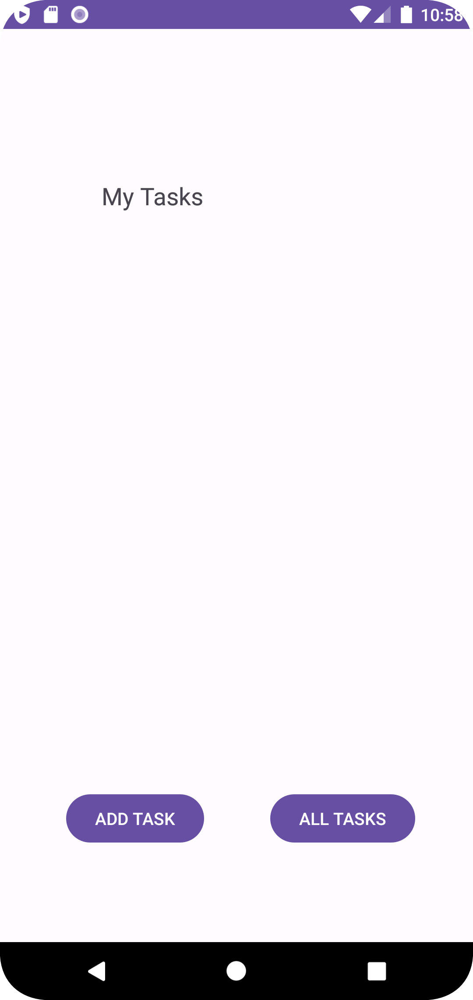
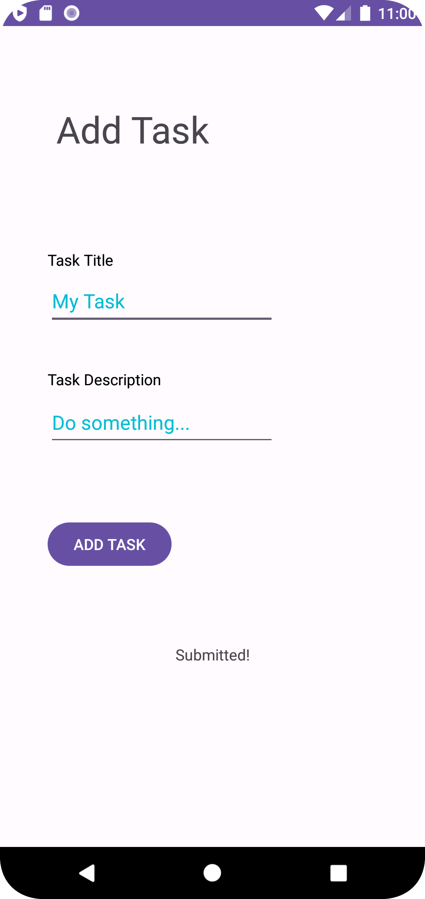
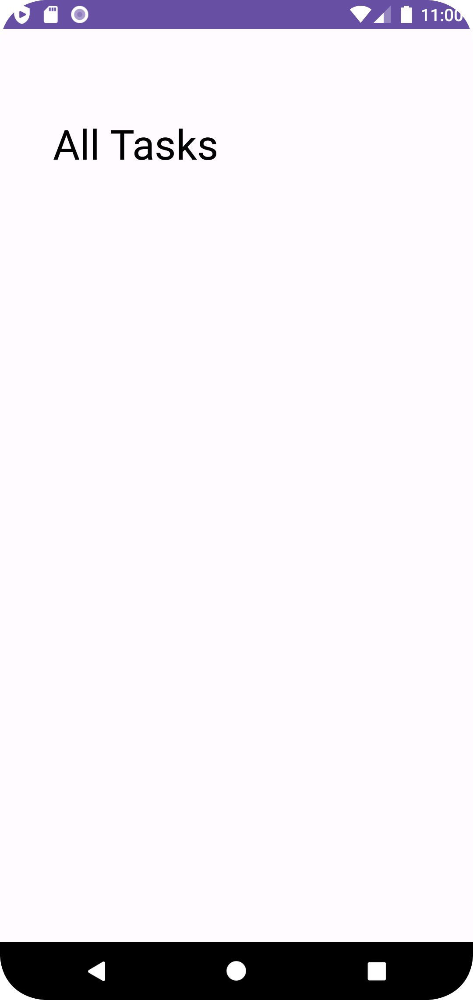

Day2:

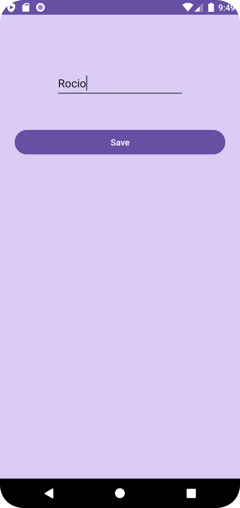

Day3:
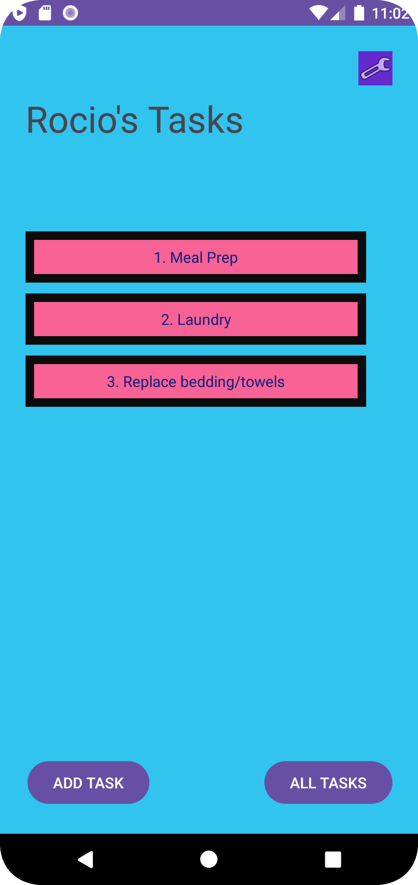
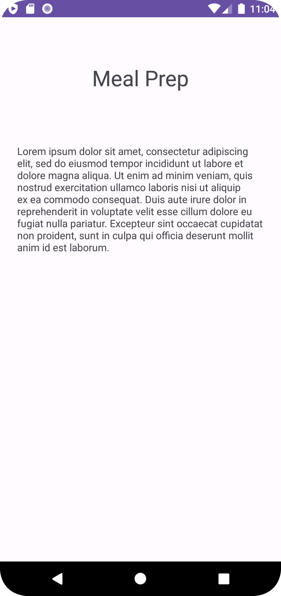

Day4:

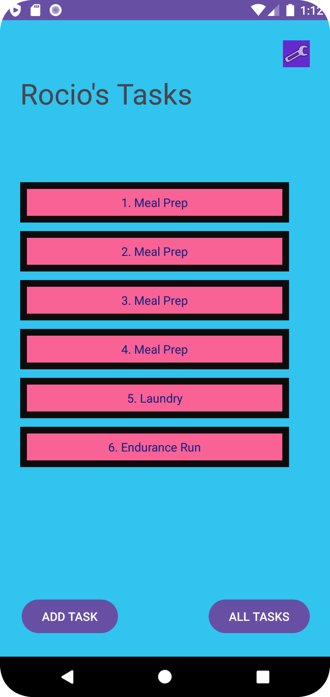

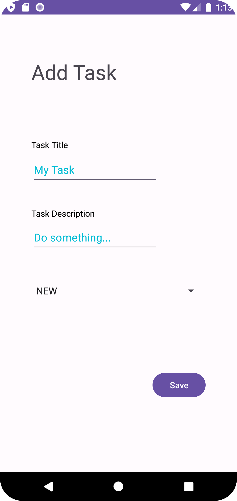

Day5:
Updated data base to use of AWS/DynamoDB
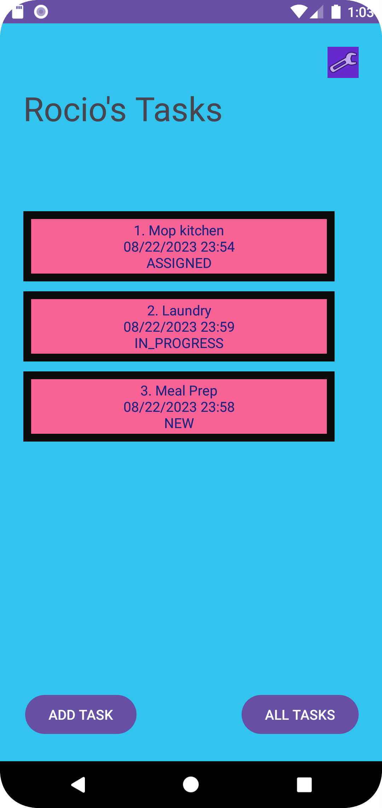

Day6::

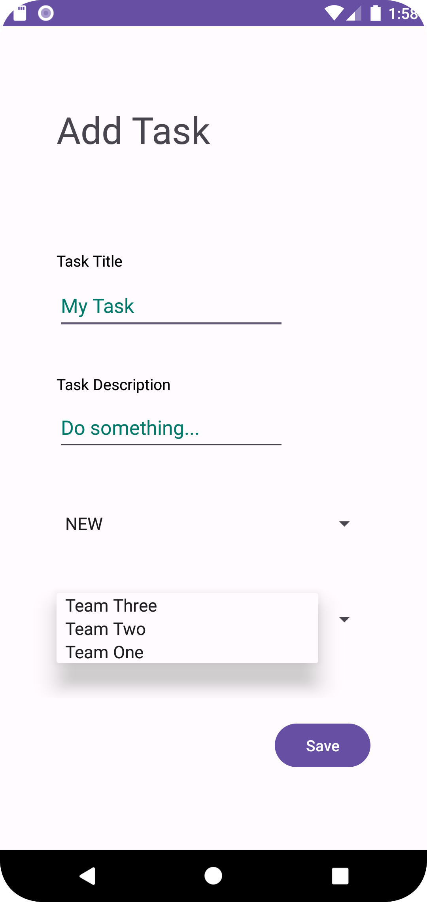
DynamoDB task table showing teamId
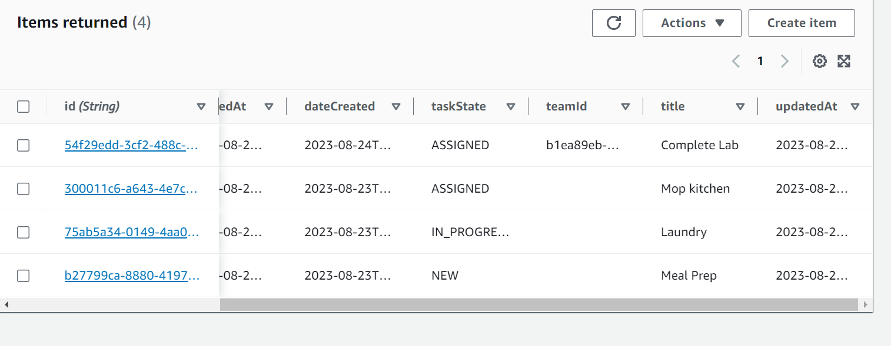

### Resources
- Rey Oliva
- Alex Chao
- ChatGPT (troubleshooting errors)