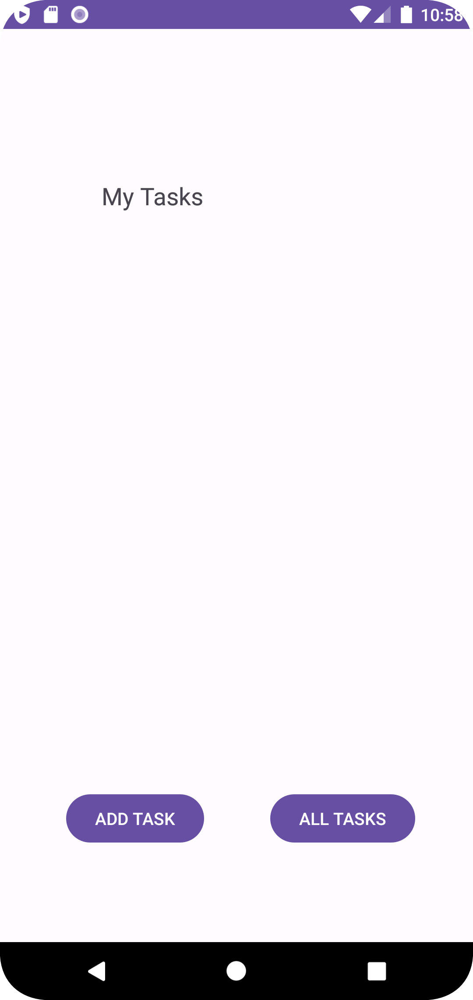
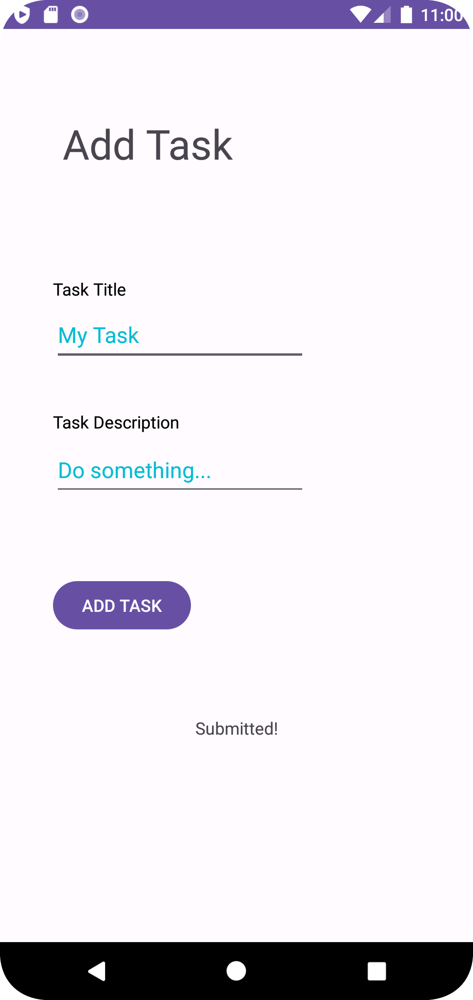
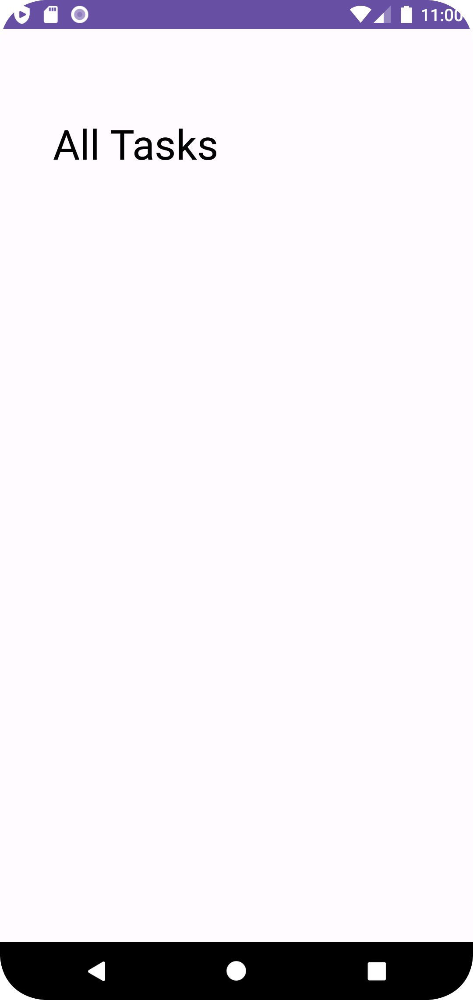
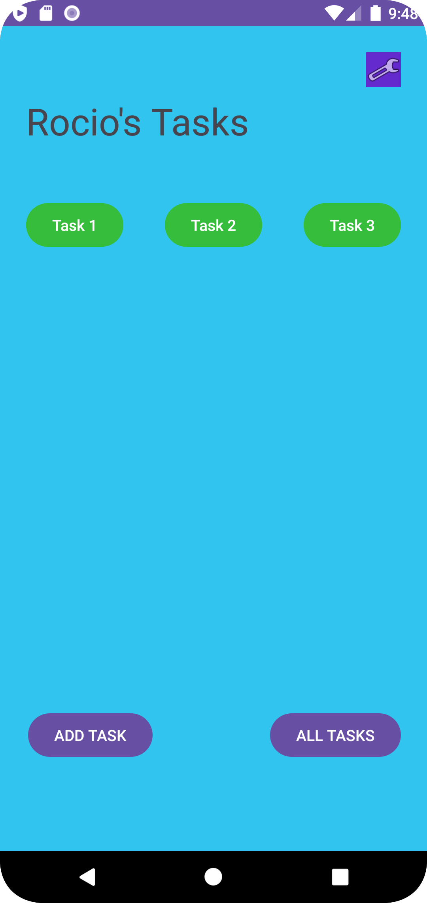
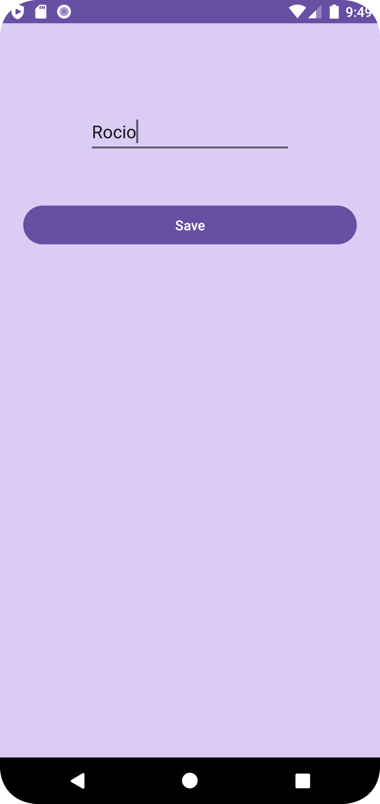

# TaskMaster

Author: Rocio Martinez

This application is built to aid users in keeping track of a list of tasks. Username can be updated from the user profile page by clicking on the gear icon. Users can simply add tasks and navigate to other pages using the buttons provided. There are default buttons for the users top 3 main tasks.

## Daily Change Log - Screenshots
Day1:

Day2:

### Resources
- Alex Chao
- ChatGPT (troubleshooting errors)